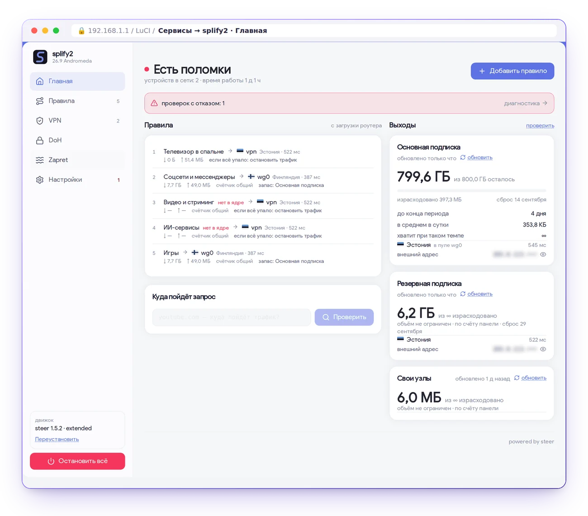
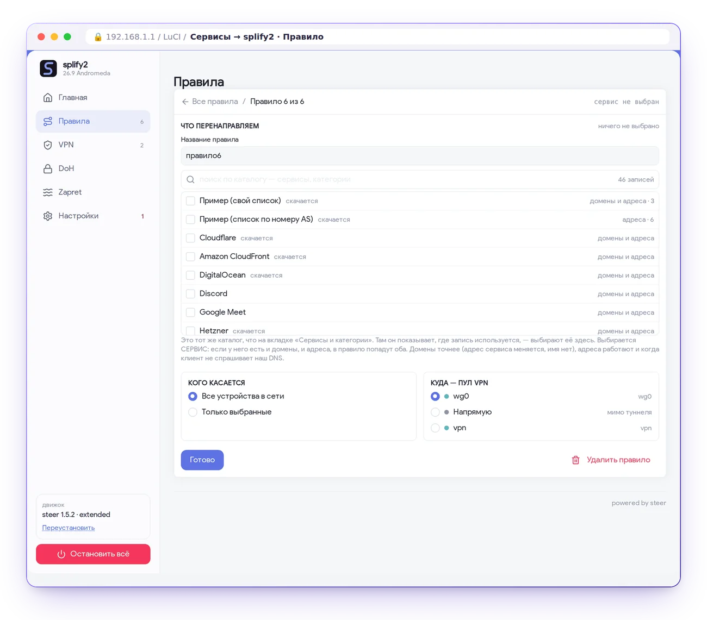
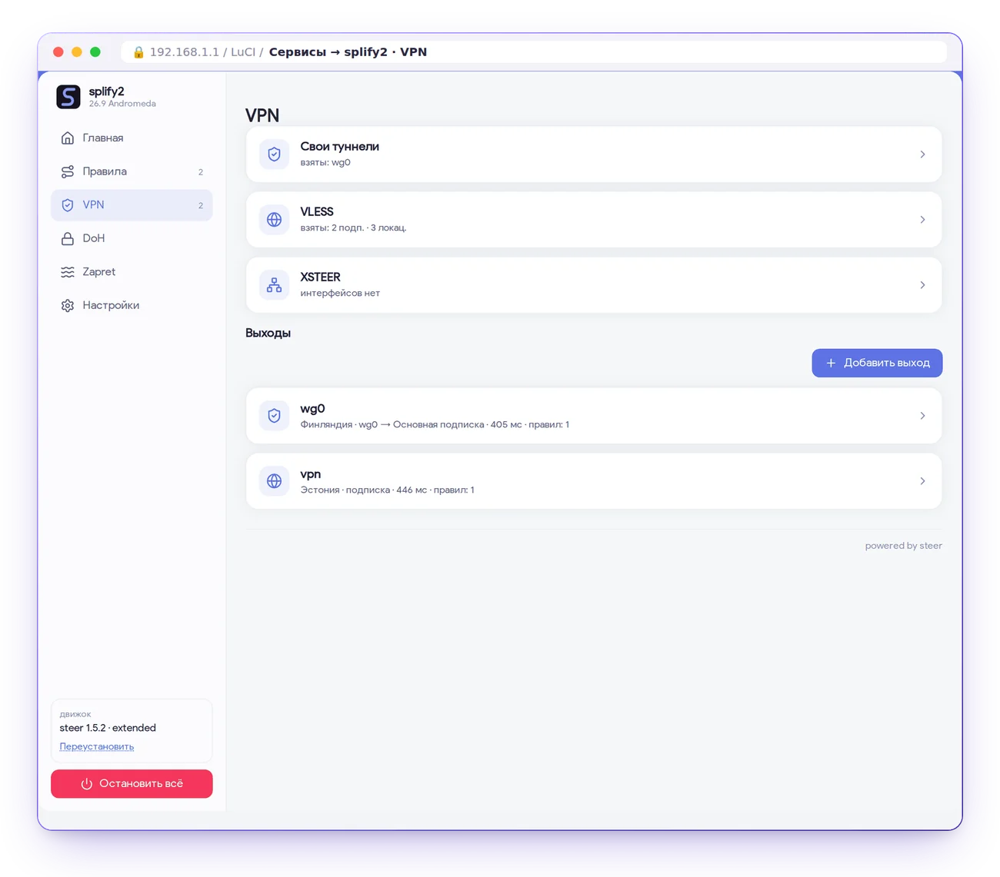
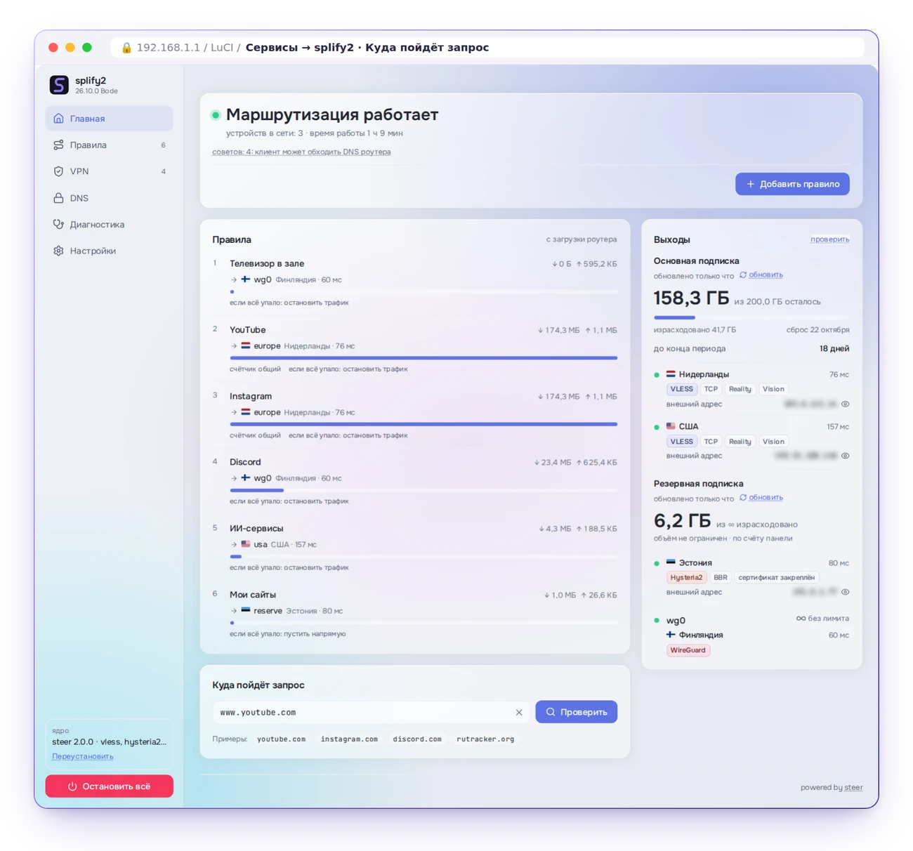
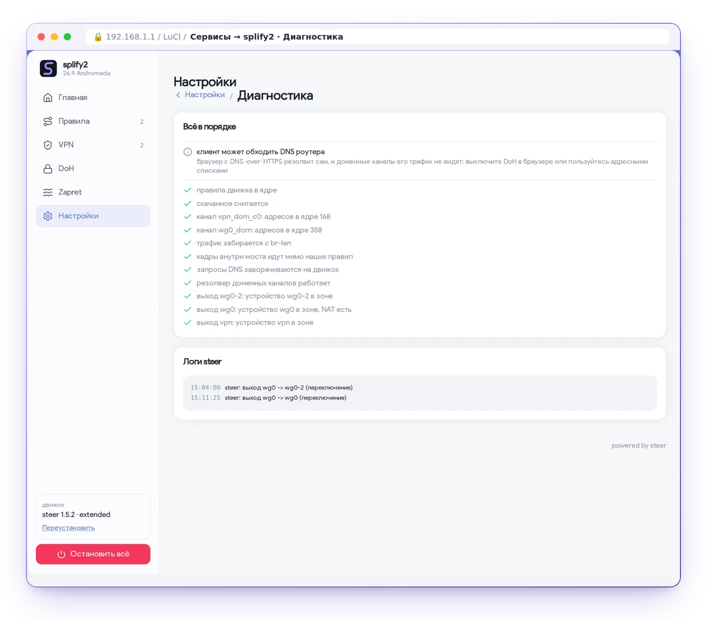

<div align="center">


# splify2

**Нужные сервисы — через туннель на всех устройствах сети. Всё остальное — напрямую.**

[](https://github.com/splify2/splify2/releases)
[](https://splify2.github.io/docs/splify2/)
[](https://t.me/ssplify)
[](https://pay.cloudtips.ru/p/fb925110)


</div>

Панель для роутера на OpenWrt — страница LuCI **Сервисы → splify2**. Вы выбираете сервисы и выход,
splify2 пишет спеку ядру [steer](https://github.com/splify2/steer), а маршрутизацию ведёт ядро steer
средствами ядра Linux: nftables, таблицы маршрутизации, домены через fake-IP.

## Возможности

- **Правила** — «что + кого касается + куда»: сервисы каталога и свои списки, вся сеть или выбранные
  устройства, выход. Читаются сверху вниз, побеждает первое совпадение
- **Выходы** — свой интерфейс роутера (WireGuard, AmneziaWG), подписки VLESS, hysteria2 и прокси
  (Trojan, Shadowsocks, SOCKS, HTTP(S), VMess), xsteer, WireGuard поверх поддельного TCP
- **Группы** — первый живой, самый быстрый, выбор вручную, раздача по весам; упало всё — трафик
  останавливается, а не уходит мимо туннеля
- **DNS** — серверы DoH, DoT, DoQ и обычные, у правила свой сервер
- **Каталог сервисов** — списки обновляются сами; при закрытом GitHub — через зеркало и запасные хосты
- **Диагностика** — проверки ядра, выходов и DNS; «куда пойдёт запрос» для любого имени

<div align="center">

<picture><source media="(prefers-color-scheme: dark)" srcset="docs/img/framed/home-dark.webp"></picture>

<table><tr><td align="center" width="50%"><picture><source media="(prefers-color-scheme: dark)" srcset="docs/img/framed/editor-dark.webp"></picture><br><sub>Правило: что, кого касается, куда</sub></td><td align="center" width="50%"><picture><source media="(prefers-color-scheme: dark)" srcset="docs/img/framed/vpn-dark.webp"></picture><br><sub>Выходы и подписки</sub></td></tr><tr><td align="center"><picture><source media="(prefers-color-scheme: dark)" srcset="docs/img/framed/explain-dark.webp"></picture><br><sub>Куда пойдёт запрос</sub></td><td align="center"><picture><source media="(prefers-color-scheme: dark)" srcset="docs/img/framed/diag-dark.webp"></picture><br><sub>Диагностика</sub></td></tr></table>

</div>

## Установка

```sh
wget -O /tmp/splify2-install.sh https://gitlab.com/xyzmean/splify2/-/raw/main/install.sh && sh /tmp/splify2-install.sh
```

Установщик сам определяет архитектуру и менеджер пакетов (apk или opkg) и ставит ядро steer и
страницу LuCI. Удаление — `splify2-purge` (без ключей показывает план, `--yes` выполняет).

> **Отчёт о работе.** splify2 раз в час отправляет короткий обезличенный отчёт, это включено по
> умолчанию. Выключить: **Настройки → О ПО**, карточка «Отчёт о работе». Что уезжает и что нет —
> [docs/TELEMETRY.md](docs/TELEMETRY.md).

## Документация

- [Быстрый старт](https://splify2.github.io/docs/quickstart/) и [как это работает](https://splify2.github.io/docs/how-it-works/)
- [Панель splify2 подробно](https://splify2.github.io/docs/splify2/) — [docs/guide.md](docs/guide.md)
- [API rpcd](https://splify2.github.io/docs/splify2/rpcd-api/) — методы бэкенда
- [Ядро steer](https://splify2.github.io/docs/steer/) и [каталог списков](https://github.com/splify2/splify2-lists)
